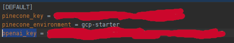

# factchecker
GPT and vector database powered natural language fact checker.  The idea is that a user enters a claim and the system
responds with a natural response about the truth of that claim as well as a citation for how it arrived at that
conclusion.

## Keys ##
In order to run this code you will need to create a keys.ini file.  This needs to contain keys for both the Pinecone
vector database and OpenAI's GPT.  Consult their documentation for how to get those keys.

This file should look like this:

Obviously put in your own pinecone_key and openai_key.  Also change pinecone_environment to the appropriate type if you
are not using gcp-starter.

## Persistence ##

Previous results are stored in a simple database.  I used sqlite for this initially, but I have added the option to use
Google Firestore instead, primarily for running on Google's Cloud Run.  To use it change the "persistence" option in
config.ini to "firestore".  Also add the "firestore_project" option to keys.ini and set it to your Google Cloud project
ID.

## Loading the data ##

In order for this system to work you will need to populate the vector database with claims to check against.  I'm adding
the capability to crawl popular fact-checking websites such PolitiFact, FactCheck.org, and Snopes, although much of that
is still under development.

The easiest way to jumpstart this, however, is to use data from the
[DataCommons.org Research Dataset](https://datacommons.org/factcheck/download).

Download this and run upload_fact_data.py under the crawlers subdirectory.

## Querying ##

There are two ways to use this program.  For simple testing you can just run query.py which gives a command line
interface but not much else.

Alternatively there is a web interface.  To start it just run "flask run" from this project's directory and go to the
URL indicated.  There you can see past queries displayed or click on "Ask" at the top to get to a web form to ask a new
query.

## Demo ##

If you just want to try it out, there is a version running on Google Cloud Run at https://factcheck-6a6mispc7a-uc.a.run.app/
